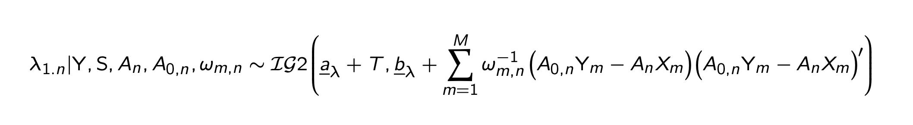
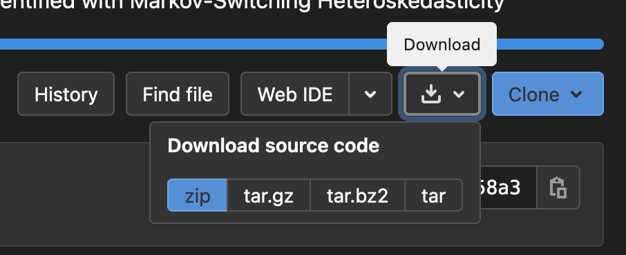

# SVAR-MSH-ID
### R Codes for Bayesian Inference for Structural Vector Autoregressions Identified with Markov-Switching Heteroskedasticity

by Tomasz Woźniak

> **Summary.** The project provides source codes and reproduction files for the paper mentioned below. Utility functions for the Gibbs sampler for Bayesian Structural Vector Autoregressions with Markov-Switching Heteroskedasticity, Savage-Dickey density ratio for uniqueness conditions and homoskedasticity hypothesis, and a marginal data density estimator are provided.
>
> **Keywords.** SVAR-MSH, identification through heteroskedasticity, Savage-Dickey density ratio for uniquenss conditions, Gibbs sampler

## Citation

To refer to the codes in publications, please, cite the following paper:

> Lütkepohl, H., Woźniak, T. (2020) Bayesian Inference for Structural Vector Autoregressions Identified with Markov-Switching Heteroskedasticity, *Journal of Economic Dynamics and Control*, 113, DOI: [10.1016/j.jedc.2020.103862](https://doi.org/10.1016/j.jedc.2020.103862).

## Corrigendum

A correct version of the first equation on the top of page 17 from the Appendix of the paper is given by:

## Project contents

The project includes:

- folder `codes` with the whole source code
- R files for the reproduction of most of the results from the paper
- file `dataBI2015.RData` with data used in the paper

## Downloading the codes

To download the codes simply click on the download icon on the top of this page

and select the format of the compressed file to be downloaded.

## Forking and contributing 

You can also choose to fork the project and clone your copy from the repository. Just follow the steps (requires a [GitLab account](https://gitlab.com)):

1. **On this page:** fork the project by clicking the icon on the top of this page ([more info](https://docs.gitlab.com/ee/user/project/repository/forking_workflow.html#creating-a-fork))

   

2. **On you computer:** clone the repository you have just forked to create its local copy that you can work with.

3. **Optional:** if you find a bug or if you improve the code, please feel free to submit a pull/merge request. ([more info](https://docs.gitlab.com/ee/topics/gitlab_flow.html#mergepull-requests-with-gitlab-flow))
